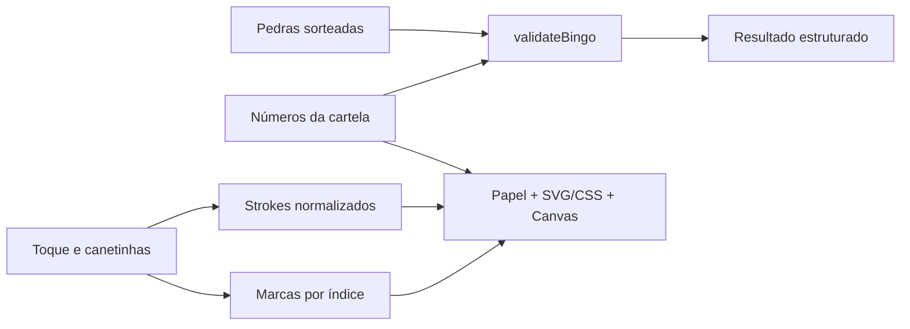

# Arquitetura

## Estrutura

```text
app/                   páginas App Router, layout, CSS e Route Handlers
components/bingo/      jogador, papel, células, canetas, canvas, bolas
components/admin/      sorteio, histórico, configurações, validador
components/ui/         ícones SVG
lib/bingo/             geração, sorteio, regras, tokens, tipos
lib/storage/           stores versionados, validação de dados persistidos
lib/server/            HMAC, initData Telegram e leitura limitada de requests
lib/telegram/          adapter do SDK (opcional)
lib/drawing.ts         limites de arte vetorial
public/                texturas SVG procedurais
scripts/               smoke browser opcional
tests/                testes de domínio/segurança/Route Handlers
docs/                 continuidade, decisões e referências
```

## Fluxo de dados



Cartela row-major com 25 posições. Índice 12 é `null`, livre automaticamente. As colunas obedecem B/I/N/G/O. A geração e o sorteio usam Web Crypto com rejection sampling, evitando viés de módulo. Nenhuma regra depende de arte, React ou localStorage.

`validateBingo` suporta linha, coluna, diagonal, quatro cantos e cartela cheia. Retorna combinação completa, combinação mais próxima, pedras faltantes e quantidade de números sorteados. O padrão inicial é linha horizontal.

## Arte

Marcas: dicionário índice → cor. CSS produz carimbo irregular com rotação/escala determinísticas, tinta translúcida e número acima da marca.

Rabiscos: `Stroke { id, color, width, tool, points }`, com coordenadas e espessura normalizadas. Canvas transparente sobre a superfície da cartela; Pointer Events, captura do ponteiro e cancelamento. Reconstituição no resize e devicePixelRatio; inversão da rotação do papel mantém tinta sob o ponteiro. Borracha usa `destination-out` só no canvas. Desfazer remove o último stroke, incluindo strokes de borracha.

Limites: 600 strokes, 3000 pontos por stroke, 30000 pontos totais. Coordenadas arredondadas a quatro casas decimais para reduzir armazenamento. Limpar desenhos, limpar marcas e trocar cartela são ações distintas; ações destrutivas pedem confirmação nativa.

## Persistência

`lib/storage/store.ts` centraliza todas as chamadas de localStorage. Hooks usam `useSyncExternalStore` com snapshot nulo no SSR para hidratação consistente. Dados carregam somente no cliente e são validados antes de uso e escrita. Falhas de quota/permissão ficam visíveis.

- `bingo:player:v1`: números, nome, data, cor, marcas e strokes.
- `bingo:game:v1`: ID local, data de início, ordem das pedras, regra.

Eventos `storage` acompanham mudanças em outras abas. O estado pertence à origem/navegador; não há conta, sala remota ou sincronização entre dispositivos. Um organizador por vez: escrita entre abas não é uma transação distribuída. Nova partida substitui o histórico local atual; arquivamento de partidas anteriores é futuro.

## Fronteira client/server e tokens

`BNG1U.<payload>`: Base64URL canônico sem padding, JSON UTF-8, versão 1. `{ v, name, nums, createdAt }` usa data em milissegundos. A UI sempre avisa “Cartela não verificada”. Parser verifica formato, versão, limites e números; não autentica autoria.

`BNG1S.<payload>.<signature>`: `{ v, uid, gid, cid, nums, iat }`, com `iat` em segundos. HMAC-SHA256 assina a mensagem completa `BNG1S.<payload>` (inclui prefixo). Verificação com tamanho fixo, Base64URL canônico e comparação constant-time no servidor.

`lib/server/*` importa `server-only`. Segredo em `BINGO_SIGNING_SECRET`, mínimo 32 caracteres, sem fallback. Nunca usar `NEXT_PUBLIC_`. Route Handlers Node.js, respostas `no-store`, corpos limitados a 12000 bytes reais, incluindo transferências sem Content-Length.

- `POST /api/cards/create`: exige segredo + token de bot + initData validado. Gera números/uid/cid server-side; escopo `gid: local`, sem aceitar identidade, números ou ID remoto do browser.
- `POST /api/cards/verify`: exige segredo e valida assinatura. Admin só exibe verificação após sucesso desse endpoint.

Sem configuração, retornam HTTP 503 sem derrubar o app. A assinatura comprova origem e identidade, não inscrição em uma partida remota nem autoridade das pedras locais. Banco, regras de emissão, autorização de organizador e claims precisam existir antes do multiplayer.

## Telegram

Adapter opcional em `lib/telegram/adapter.ts`: ready/expand, `getInitData`, haptic opt-in. Não usa `initDataUnsafe`; funciona sem SDK. O SDK oficial ainda não é carregado e a UI de emissão ainda não é ligada ao endpoint.

O servidor valida HMAC de initData conforme Telegram, rejeita campos duplicados, data muito antiga (>300s) ou futura (>30s), e extrai uid só depois da verificação. initData pode ser reutilizado durante essa janela: quotas/idempotência e sessão persistente pertencem à próxima fase.

## Deploy e QA

Next.js na Vercel; nada depende de filesystem persistente ou memória de função serverless. Fontes locais com licença OFL e texturas originais. `npm ci` reproduz dependências fixadas no lockfile.

Checks: lint, typecheck, testes Node/tsx e build. Smoke opcional com Playwright externo testa interações, persistência e layouts; instruções em `docs/QA.md`. Acesso real no Telegram e testes em aparelhos Safari/Android seguem como próximos passos.
