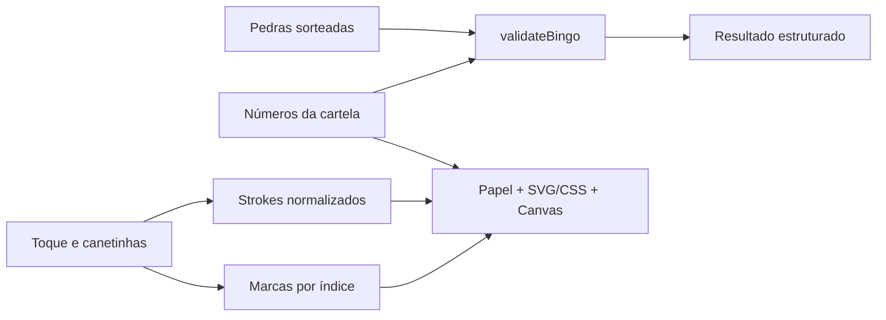
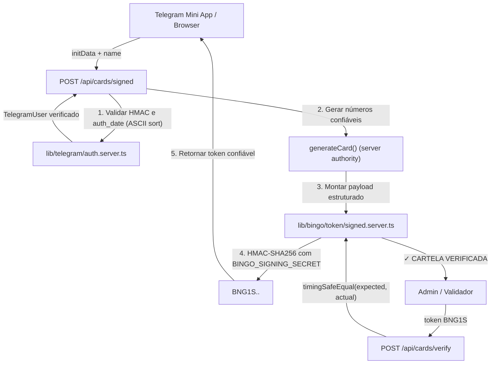

# Arquitetura

## Estrutura

```text
app/                   páginas App Router, layout, CSS e Route Handlers
  api/
    auth/telegram/     validação de sessão/identidade Telegram Mini Apps
    cards/signed/      emissão autoritativa de cartelas BNG1S (exige Telegram em prod)
    cards/create/      emissão compatível Telegram
    cards/verify/      verificação de autenticidade e integridade
    health/            diagnóstico seguro de configuração (sem vazamento de secrets)
components/bingo/      jogador, papel, células, canetas, canvas, bolas
components/admin/      sorteio, histórico, configurações, validador
components/ui/         ícones SVG procedurais
lib/bingo/             domínio puro (geração, sorteio, validação de regras)
  token/               camada modular de tokens
    types.ts           tipagem estrita de UnsignedCard, SignedCard e resultados
    base64url.ts       codificação canônica UTF-8 sem padding
    unsigned.ts        validação e codificação de BNG1U
    parser.ts          parsing seguro e identificação de formato
    signed.server.ts   server-only: HMAC-SHA256, signCard, verifyCard, verifyToken
lib/storage/           stores versionados, validação de dados persistidos
lib/server/            handlers server-side, HMAC, requisições limitadas
lib/telegram/          camada de integração Telegram
    types.ts           tipos de usuário, WebApp e opções de verificação
    client.ts          adapter client, detecção de ambiente, lifecycle init, haptics
    auth.server.ts     server-only: validação oficial de HMAC, ordenação ASCII e replay freshness
lib/drawing.ts         orçamento e limites de arte vetorial
public/                texturas SVG e ícones procedurais
tests/                 testes automatizados de domínio, tokens, segurança, rotas e Telegram
docs/                  continuidade, decisões, guias de setup e deploy
```

## Fluxo de dados



Cartela row-major com 25 posições. Índice 12 é `null`, livre automaticamente. As colunas obedecem B/I/N/G/O. A geração e o sorteio usam Web Crypto com rejection sampling, evitando viés de módulo. Nenhuma regra depende de arte, React ou localStorage.

`validateBingo` suporta linha, coluna, diagonal, quatro cantos e cartela cheia. Retorna combinação completa, combinação mais próxima, pedras faltantes e quantidade de números sorteados. O padrão inicial é linha horizontal.

## Arte

Marcas: dicionário índice → cor. CSS produz carimbo irregular com rotação/escala determinísticas baseadas em `(index, number)`, tinta translúcida e número escuro perfeitamente legível acima da mancha.

Rabiscos: `Stroke { id, color, width, tool, points }`, com coordenadas e espessura normalizadas. Canvas transparente sobre a superfície da cartela com `contain: paint`; Pointer Events, captura do ponteiro e cancelamento. Reconstituição no resize e devicePixelRatio com limpeza de buffer via matriz identidade; inversão da rotação do papel calculada no início do traço mantém tinta sob o ponteiro com 60fps sem layout thrashing. Borracha usa `destination-out` só no canvas. Desfazer remove o último stroke, incluindo strokes de borracha.

Limites: 600 strokes, 3000 pontos por stroke, 30000 pontos totais. Coordenadas arredondadas a quatro casas decimais para reduzir armazenamento. Limpar desenhos, limpar marcas, trocar cartela e substituir por cartela verificada são ações distintas protegidas por diálogo modal tátil de confirmação em papel/madeira, sem caixas de diálogo nativas do navegador.

## Persistência

`lib/storage/store.ts` centraliza todas as chamadas de localStorage. Hooks usam `useSyncExternalStore` com snapshot nulo no SSR para hidratação consistente. Dados carregam somente no cliente e são validados antes de uso e escrita. Falhas de quota/permissão ficam visíveis.

- `bingo:player:v1`: números, nome, data, cor, marcas e strokes.
- `bingo:game:v1`: ID local, data de início, ordem das pedras, regra.

Eventos `storage` acompanham mudanças em outras abas. O estado pertence à origem/navegador; não há conta, sala remota ou sincronização entre dispositivos. Um organizador por vez: escrita entre abas não é uma transação distribuída. Nova partida substitui o histórico local atual; arquivamento de partidas anteriores é futuro.

## Fronteira client/server e tokens



### BNG1U — Cartela Unsigned
`BNG1U.<payload>`: Base64URL canônico sem padding, JSON UTF-8, versão 1. `{ v, name, nums, createdAt }` usa data em milissegundos.
- Criada no cliente para jogos locais e informais.
- A UI sempre avisa claramente: `⚠ CARTELA NÃO VERIFICADA`.
- Parser confere estrutura, limites e números; não autentica autoria nem garante contra adulteração.

### BNG1S — Cartela Signed
`BNG1S.<payload>.<signature>`: `{ v: 1, cid, gid, nums, iat, uid?, name? }`, com `iat` em segundos Unix.
- Criada exclusivamente pelo servidor.
- Mensagem assinada: `BNG1S.<payload>` (o prefixo é explicitamente vinculado à assinatura).
- Assinatura: HMAC-SHA256 (`BINGO_SIGNING_SECRET`, ≥32 caracteres de alta entropia).
- Verificação segura: `timingSafeEqual` com tamanho fixo (32 bytes = 43 caracteres Base64URL). Qualquer alteração de um único byte no payload ou assinatura invalida o token.
- Números da cartela são gerados estritamente pelo servidor (`nums: generateCard()`); o cliente nunca pode impor números para serem assinados.

### Endpoints de Confiança
`lib/server/*` e `*.server.ts` importam `server-only`. Segredo em `BINGO_SIGNING_SECRET`, sem fallback. Nunca usar `NEXT_PUBLIC_`. Respostas com cabeçalho `Cache-Control: no-store`. Limite de 12000 bytes e validação de Content-Type.

- `POST /api/cards/signed`: emite cartelas BNG1S.
  - **Em Produção (`NODE_ENV === "production"`):** Exige obrigatoriamente `initData` do Telegram autenticado. Sem `initData`, retorna `401 UNAUTHORIZED`. O mecanismo `dev-local` é terminantemente proibido. Se `TELEGRAM_BOT_TOKEN` estiver ausente, retorna `503 SERVICE_UNAVAILABLE`.
  - **Em Desenvolvimento (`NODE_ENV !== "production"`):** Permite teste local com `uid: "dev-local"` e identificação visual explicita como DEV.
- `POST /api/cards/verify`: verifica tokens BNG1S ou BNG1U. Retorna resposta estruturada distinguindo: signed válido, unsigned válido, assinatura inválida, payload inválido e formato malformado.
- `POST /api/auth/telegram`: valida initData com `TELEGRAM_BOT_TOKEN` e retorna dados públicos do usuário autenticado sem vazar material criptográfico.
- `GET /api/health`: endpoint seguro de diagnóstico de deploy. Retorna exclusivamente flags booleanas (`signingConfigured`, `telegramConfigured`) sem expor material confidencial.

## Telegram Mini App

- `lib/telegram/client.ts`: adapter client-side que detecta ambiente (`isTelegramEnvironment()`), obtém `getInitData()`, aciona `ready()` e `expand()`, gerencia haptics táteis (`impact`, `notification`, `selection`) e expõe `getUnsafeDisplayUser()`.
- **Atenção:** `initDataUnsafe` é utilizado exclusivamente para exibição transitória de UX (ex: placeholder do nome). Nunca é confiado para autorização ou emissão.
- `lib/telegram/auth.server.ts`: validação criptográfica estrita do HMAC de initData conforme especificação oficial do Telegram. Ordenação determinística por code points ASCII `(a < b ? -1 : a > b ? 1 : 0)`, derivação de chave com `"WebAppData"` + `TELEGRAM_BOT_TOKEN`, verificação timing-safe e janela de validade (`auth_date` com margem de 30s para clock skew e expiração de 300s).

## Deploy e QA

Next.js na Vercel; nada depende de filesystem persistente ou memória de função serverless. Fontes locais com licença OFL e texturas procedurais originais.

Checks: lint, typecheck, 44 testes automatizados e build de produção.
Guias dedicados: `docs/TELEGRAM_SETUP.md` (BotFather) e `docs/DEPLOYMENT.md` (Vercel).
